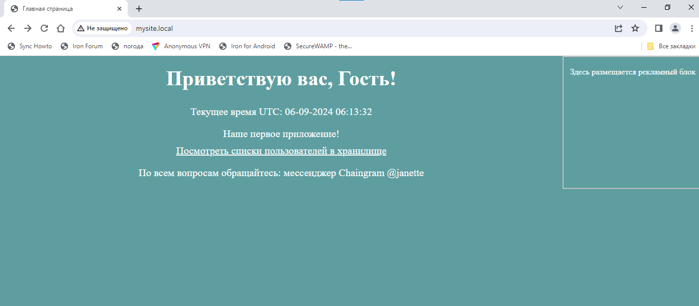
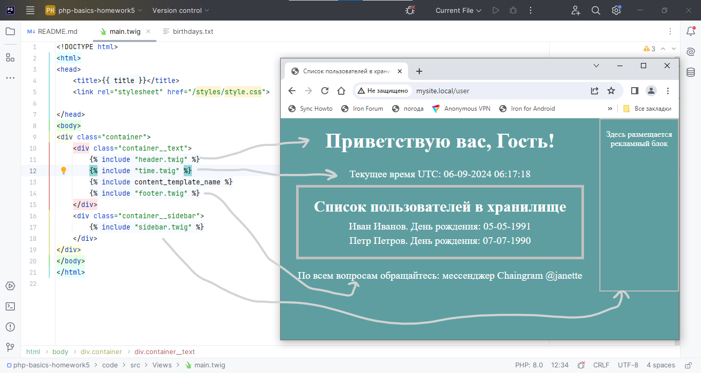
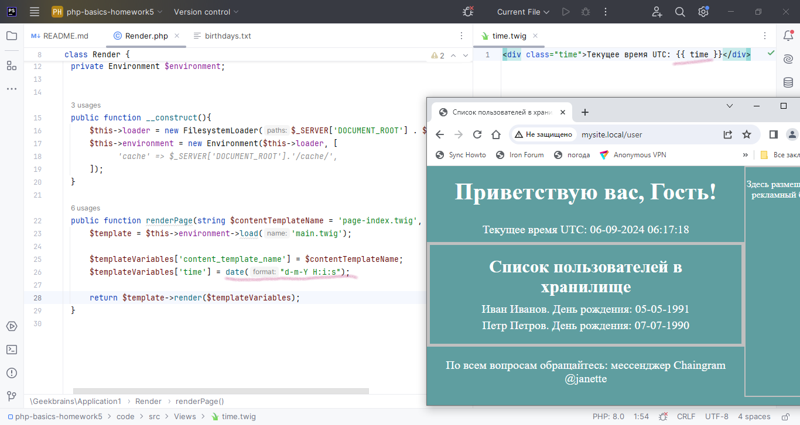
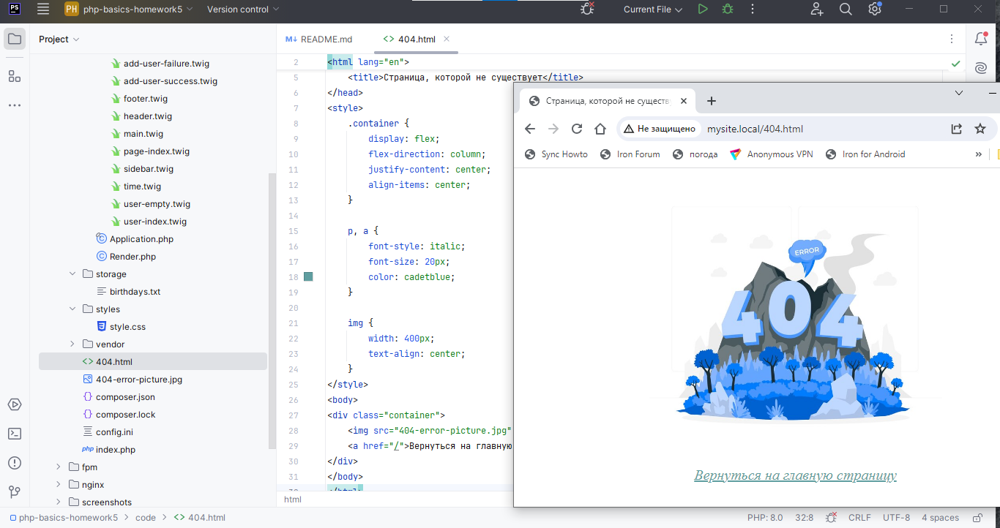
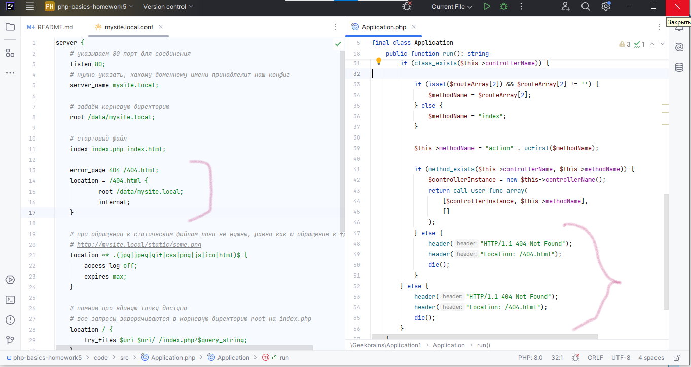
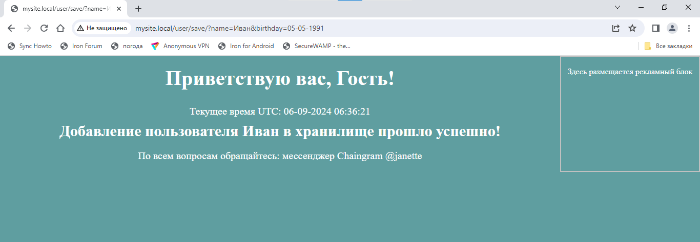
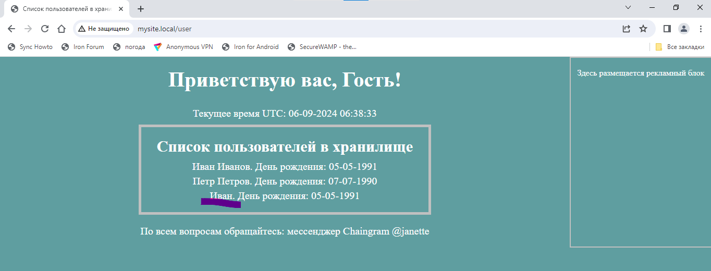

# PHP BASICS. Workshop 5. Homework. Тогочакова Евгения

1.Добавьте к шаблону подключение файлов стилей так, чтобы в дальнейшем можно было дорабатывать внешний вид системы.

2.Сформируйте еще три подключаемых к скелету блока – шапку сайта (она всегда будет одинаковой по стилю и располагаться в самой верхней части), подвал сайта (также одинаковый, но в нижней части) и sidebar (боковая колонка, которую можно наполнять новыми элементами).

3.Средствами TWIG выводите на экран текущее время.

4.Создайте обработку страницы ошибки. Например, если контроллер на найден, то нужно вызывать специальный метод рендеринга, который сформирует специальную страницу ошибок.

5.Для страницы ошибок формируйте HTTP-ответ 404. Это можно сделать при помощи функции header.

6.Реализуйте функционал сохранения пользователя в хранилище. Сохранение будет происходить при помощи GET-запроса.

/user/save/?name=Иван&birthday=05-05-1991

